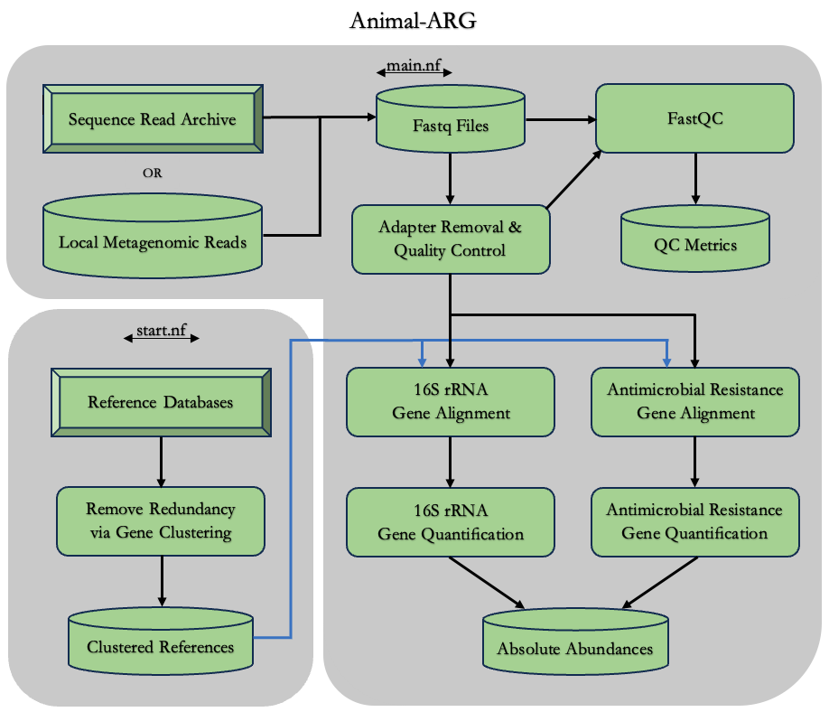

# Nextflow Pipeline for Estimating Antimicrobial Resistance Gene Abundance in Metagenomic Samples
### This analytical framework is discussed extensively here:  

    Ackerson,Leland K.,,IV. Analytical Framework for Estimating Antimicrobial Resistance Gene Abundance in Metagenomic Samples  
        of Animal Agriculture Origin, Michigan State University, United States -- Michigan, 2023. ProQuest

### The documentation for this nextflow project can be found here:  
&nbsp; &nbsp; &nbsp; &nbsp; &nbsp; [Animal-ARG Documentation](https://leeackersoniv.github.io/animal-ARG-documentation/)
 
 
## Estimation of ARG Abundance from Shotgun Metagenomic Sequence Data
### Data Flow Diagram 

### Methodology
#### 1.  Quality Control + Pre-Processing
~FastQC is performed on both the raw reads and post-processing clean reads.  
~Results from quality control analysis are deposited in the 'QCmetrics' folder upon completion of the workflow proccesses.  
~Adapter trimming and read quality filtering are performed using BBDuk (BBTools).

#### 2.  Download Reference Gene Databases 
~ARG Reference: The Comprehensive Antibiotic Resistance Database (CARD)
~16S rRNA Reference: GreenGenes Database 

#### 3. Prepare Reference Gene Catalog
~CD-HIT-EST is utilized to cluster each reference database and remove redundancy. 
~Clustered references are indexed (BWA INDEX) prior to subsequent alignment.

#### 4a.  Antimicrobial Resistance Gene Mapping
~Reference Database: The Comprehensive Antibiotic Resistance Database (CARD).  
~Alignement Software: BWA MEM

#### 4b.  16s rRNA Gene Mapping
Necessary for metagenome taxonomical quantification, and downstream normalization.  
~Reference Database: GreenGenes Database  
~Alignement Software: BWA MEM

#### 5.  Gene Quantification
~Gene counts are weighted by number of mappings for a read of interest.  
For example, 3 gene mappings by one read results in the allocation of 1/3 of a count for each gene.

